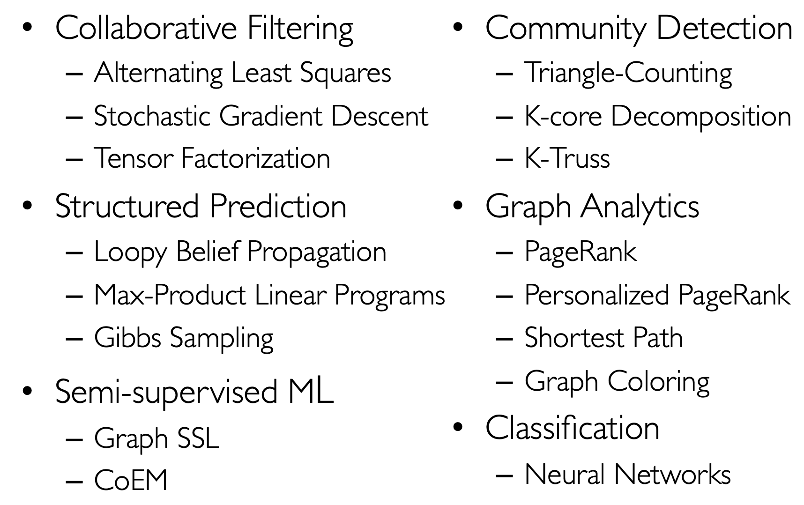

# Spark GraphX
## Graph Parallel Algorithms

- Faster to Slowest : GraphLab > Naive Spark > Hadoop
- If you do an end-to-end pipeline atm (Dec 2023), graphx might be quicker because all the data is in the spark ecosystem so you might not need to worry about conversions