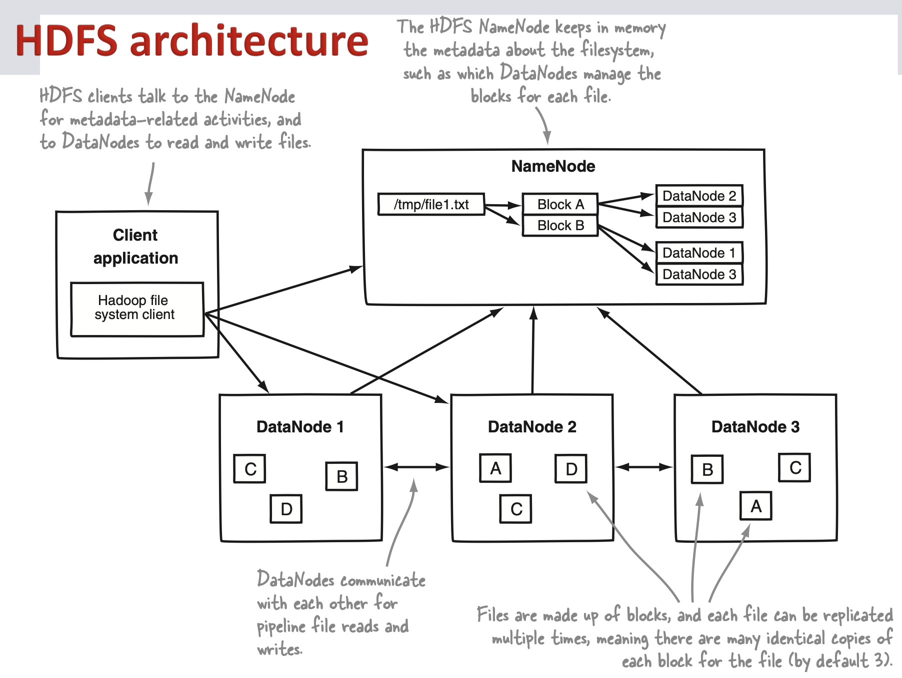
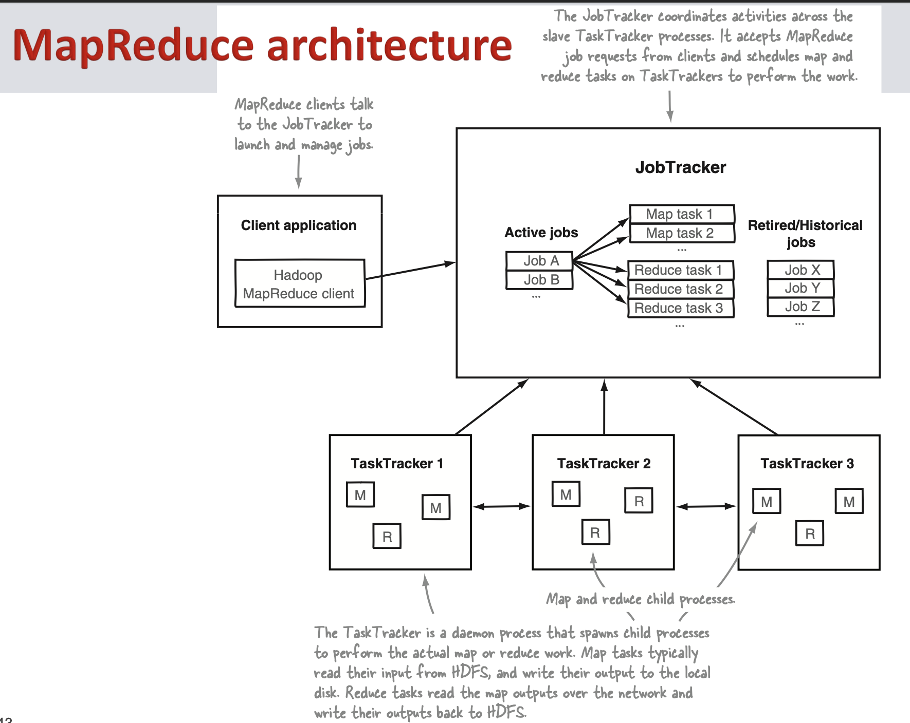

# Hadoop Basics
- **Scale-Up vs Scale-Out**
	1. **Scale Up (Vertical Scaling):**
	- **Definition:** Scaling up involves increasing the capabilities of an individual hardware or software component within a system.
	- **Example:** Upgrading the CPU, adding more memory (RAM), or increasing storage capacity on a single server.
	- **Advantages:**
	 - Simplicity: Adding resources to a single machine is often simpler and may not require significant changes to the architecture.
	 - Potential Performance Gains: Some applications benefit from increased resources on a single machine, especially if they are not inherently designed for distributed computing.
	- **Disadvantages:**
	 - Limited Scalability: There is a practical limit to how much a single machine can be scaled, and once that limit is reached, further improvements may become prohibitively expensive.
	 - Single Point of Failure: If the scaled-up machine fails, the entire system could be affected.
	
	2. **Scale Out (Horizontal Scaling):**
	- **Definition:** Scaling out involves adding more nodes (machines) to a distributed system, thereby increasing the overall capacity and computational power by distributing the workload.
	- **Example:** Adding more servers to a cluster or increasing the number of instances in a cloud-based application.
	- **Advantages:**
	 - Improved Scalability: Scaling out allows for more granular and cost-effective increases in capacity. As demand grows, additional nodes can be added to the system.
	 - Redundancy: Distributed systems often have built-in redundancy, reducing the impact of failures on the overall system.
	 - Better Resource Utilization: Resources can be allocated dynamically based on demand, improving overall resource utilization.
	- **Disadvantages:**
	 - Increased Complexity: Managing a distributed system with multiple nodes can be more complex than managing a single powerful machine.
	 - Communication Overhead: In some cases, the need for communication between nodes can introduce overhead.
- Challenges in Big Data
	- Storing (Bottleneck Access Speeds)
		- Scale-Up vs Scale-Out
	- Parallelism
		- Split & Aggregation 
		- Coordination (synchronization, deadlocks)  
		- Limited network speed (slower than storage speed)
		- Load distribution  
		- Machine failure (1-5% drives per year)
	- Reliability: Failure is not an option, it’s a rule!
		- 1 machine, mean time between failure (MTBF): 3 yrs
		- 1000 machines, MTBF < 1 day  
		- Need fault tolerant storage with reasonable availability guarantees
		- Handle hardware faults transparently
		- Partial failure rather than full halt
		- If a node fails, another picks up its load
		- A fixed node can re-join without a group restart  
		- Data backup, ease of use and security, affordable
- Hadoop Design Principles
	- A scalable fault-tolerant grid operating system for data storage and processing
	-  Performance shall scale linearly  
	-  System shall manage and heal itself
		- Automatically & transparently route around failure
		- Speculatively execute redundant tasks if certain nodes are detected to be slow
	- Compute/code should move to data (Lower latency, lower (network) bandwidth)
	-  Simple core, modular and extensible
- Hadoop Goals
	- Scalability: Petabytes (1015 Bytes) of data on thousands of nodes  
	- Reliability/Fault tolerance: provisions for redundancy and recovery  
	- Heterogeneity: different OS & hardware
	- Concurrency: concurrent access
	- Transparency & Abstraction:
		- works as a whole centralized system, instead of collection of computers -- distributed nature hidden from its users
		- hide complexity from user, unified interface to interact with the system
	- Affordability: commodity machines only
- RDBMS vs Hadoop
	- Functional programming (MapReduce) vs. Declarative queries (SQL)
		- SQL is a high-level declarative language; state output, let database engine figure out execution plan
		- MapReduce specifies execution steps – more flexible; can build statistical models, reformat data
	- Structured vs. Unstructured data
		- SQL (Structured Query Language) targeted at handling structured data, Hadoop can also handle unstructured data
	- Relational schema vs. Key/Value pairs
		- Structure defined by a schema, many data do not fit this model (text, images, XML, etc.)
		- Hadoop transforms un/semi-structured data to keys&values
	- Scaling up vs. Scaling out
		- For bigger database, buy a bigger machine (not cost-efficient), Hadoop uses 10-100 commodity machines
		- A machine with 10 times the power of a standard PC costs a lot more than putting 10 such PCs in a cluster.
	- Offline batch vs. Online processing
		- Both data warehouses and Hadoop designed for the former: write-once, read-many-times type of store
- Running Hadoop - “Running Hadoop” means running a set of HDFS and MapReduce daemons (or programs) on different servers in your network. Daemons have specific roles; some exist only on one server, some exist across multiple: 1. NameNode, 2.Secondary NameNode, 3.DataNode, 4. JobTracker, 5. TaskTracker
- Deamons
	Daemons (pronounced "dee-mons") are background processes or services that run on a computer system, typically without direct interaction with users. These processes provide essential background services, manage hardware resources, or perform system tasks. Daemons are a fundamental concept in Unix-like operating systems, and they play a crucial role in the overall stability and functionality of the system.
	
	Here are some key characteristics and examples of daemons:
	
	1. **Background Processes:**
	   - Daemons run in the background, detached from any specific user interface. They operate independently of user sessions and continue to run even when no users are logged in.
	
	2. **No User Interaction:**
	   - Daemons typically do not require user interaction. They operate silently in the background, performing tasks without direct input from users.
	
	3. **System Services:**
	   - Daemons often provide system services or manage specific aspects of the operating system. Examples include network services, printing services, and scheduling tasks.
	
	4. **Initiation and Termination:**
	   - Daemons are usually initiated during the system startup process and terminated during system shutdown. They are designed to run continuously in the background, waiting for events or performing scheduled tasks.
	
	5. **Examples of Daemons:**
	   - **HTTP Daemon (httpd):** Manages the Apache web server, handling requests and serving web pages.
	   - **Print Daemon (lpd):** Manages print jobs and print queues on a system.
	   - **Network Time Protocol Daemon (ntpd):** Synchronizes the system clock with a remote time server.
	   - **Domain Name System Daemon (named or dnsmasq):** Resolves domain names to IP addresses, providing DNS services.
	   - **Secure Shell Daemon (sshd):** Manages secure shell (SSH) connections to the system.
	   - **Database Daemons (e.g., mysqld, mongod):** Manage database services.
	
	6. **Naming Convention:**
	   - Daemons often have names ending in "d," indicating that they are daemons. For example, the HTTP daemon is commonly named "httpd."
	
	7. **Configuration Files:**
	   - Daemons are typically configured through specific configuration files. These files allow administrators to customize the behavior of the daemon based on system requirements.
- Hadoop Structure
		+----------------------------------------+
		|              Hadoop Cluster                          |
		|                                                                   |
		|          +----------------+                         |
		|          |    NameNode    |                            |
		|          +----------------+                         |
		|               /      \                                             |
		|              /        \                                            |
		|             /          \                                           |
		| +----------------+ +----------------+ |
		| |  DataNode  |  |  DataNode  |  ...            | |
		| +----------------+ +----------------+ |
		|                                                                    |
		|          +----------------+                          |
		|          |    JobTracker       |                          |
		|          +----------------+                          |
		|                 /      |      \                                     |
		|              /       |       \                                       |
		| +----------------+ +----------------+ |
		| |  TaskTracker  | |  TaskTracker  | ...       | |
		| +----------------+ +----------------+ |
		+----------------------------------------+
- NameNode
	- Master of HDFS, directs the slave DataNode daemons to perform the low-level I/O tasks
	- Bookkeeper; keeps track of  
	    ▪ How files are broken down into file blocks, 
	    ▪ Which compute nodes store which blocks, 
	    ▪ Overall health of the distributed file system
	-   NameNode server: memory and I/O intensive; 
		- doesn’t double as a DataNode or a TaskTracker
	-  Single point of failure (!)
- Secondary NameNode (SNN)
	-  also single SNN per cluster, resides on its own machine
	-  take snapshots of NameNode (i.e., HDFS metadata) at intervals defined by cluster configuration 
	-  minimize the downtime and loss of data due to single NameNode
- DataNodes 
	-  reading and writing HDFS blocks to actual files on the local filesystem
	-  may communicate with other DataNodes to replicate its data blocks for redundancy
- JobTracker  
	- liaison between your application and Hadoop § determines the execution plan
	- which files to process
	- assigns nodes to different tasks
	- monitors running jobs
	- re-launches failed task, possibly on a different node, up to a predefined limit of re-tries
- TaskTrackers  
	- manage the execution of individual tasks that JobTracker assigns on each slave node
	- one TaskTracker per slave node, but can handle many map or reduce tasks in parallel
	- constantly communicate with the JobTracker to report “heartbeat”
- HDFS Architecture 
- Map Reduce Architecture 
- [Explain Map Reduce](https://research.google/pubs/pub62/)
	MapReduce is a programming model and processing framework designed for parallel and distributed processing of large datasets across a cluster of computers. It was introduced by Google and popularized by Apache Hadoop, an open-source implementation. The MapReduce model consists of two main phases: the Map phase and the Reduce phase.
	
	1. **Map Phase:**
	   - **Input Data:** The input data is divided into fixed-size chunks, and each chunk is processed independently by a Map task.
	   - **Map Function:** The user-defined Map function is applied to each record in the input data. This function transforms the input data into a set of key-value pairs.
	   - **Intermediate Output (Key-Value Pairs):** The Map function generates an intermediate set of key-value pairs, where the key represents a category or grouping, and the value is the data associated with that category.
	
	2. **Shuffle and Sort:**
	   - The intermediate key-value pairs are shuffled and sorted based on their keys. This step ensures that all values associated with a particular key are grouped together and ready for processing by the Reduce tasks.
	
	3. **Reduce Phase:**
	   - **Grouping by Key:** The framework groups the sorted key-value pairs by key and sends each group to a separate Reduce task.
	   - **Reduce Function:** The user-defined Reduce function is applied to each group of key-value pairs. This function performs the final processing on the data, producing the desired output.
	   - **Output Data:** The final output of the MapReduce job is typically a set of key-value pairs, where the key represents the result's category or grouping, and the value is the computed result.
	
	**Key Characteristics of MapReduce:**
	
	- **Parallel Processing:** MapReduce processes data in parallel across multiple nodes in a cluster, making it highly scalable.
	  
	- **Fault Tolerance:** MapReduce frameworks, like Apache Hadoop, provide fault tolerance by replicating intermediate data and restarting failed tasks on other nodes.
	
	- **Distributed Computing:** It leverages the distributed computing capabilities of a cluster to handle and process massive amounts of data.
	
	- **Simplicity:** Developers need to focus on implementing the Map and Reduce functions, while the framework takes care of distributing tasks, managing parallel execution, and handling node failures.
	
	- **Batch Processing:** MapReduce is primarily designed for batch processing of large datasets. It is not suitable for real-time processing tasks.
	
	**Example: Word Count with MapReduce:**
	
	As a classic example, let's consider the word count problem. In the Map phase, the input data (a collection of documents) is processed to generate key-value pairs where the key is a word, and the value is 1. The Shuffle and Sort phase groups the key-value pairs by word. In the Reduce phase, the values for each word are summed, providing the final count for each word in the entire dataset.
	
	MapReduce is a powerful paradigm for processing and analyzing large-scale data, and its concepts have influenced the development of various big data processing frameworks and tools.
- Re-launching tasks on other machines enabled by 2 key properties of MapReduce jobs: 
	- idempotent (re-executing a task will always produce the same result), and
	- have no side effects (re-executing a task will not change other state/affect other nodes)
- What is the puprose of shuffle and sort ? - The shuffle and sort phases are responsible for two primary activities: determining the reducer that should receive the map output key/value pair (called partitioning); and ensuring that, for a given reducer, all its input keys are sorted.
- Hadoop Tools
	- High-level languages (e.g. Hive, Pig)  
	- Predictive analytics (e.g. Mahout for ML)  
	- Coordination & workflow (e.g. ZooKepper, Oozie)
	- HBASE
- Hadoop Limitations
	While Hadoop has proven to be a powerful and scalable framework for processing and storing large-scale data, it does have certain limitations and challenges. Here are some key limitations associated with Hadoop:
	
	1. **Complexity:**
	   - Hadoop, particularly the MapReduce programming model, has a steeper learning curve compared to some other data processing frameworks. Developing and debugging MapReduce jobs can be complex.
	
	2. **Latency:**
	   - Hadoop's traditional batch processing model is not suitable for low-latency or real-time processing. It is optimized for processing large volumes of data in batches, which might not be ideal for applications requiring near-real-time responses.
	
	3. **Not Suitable for Small Data:**
	   - Hadoop may introduce unnecessary overhead for small datasets or simple processing tasks. The distributed nature of Hadoop is most beneficial when dealing with large-scale data.
	
	4. **Hadoop 1.x Single Point of Failure:**
	   - In Hadoop 1.x, the JobTracker and the NameNode were single points of failure. If either of these components failed, it could impact the entire Hadoop cluster. Hadoop 2.x introduced High Availability configurations to address this issue.
	
	5. **Limited Support for Complex Analytics:**
	   - While Hadoop is excellent for batch processing, it may not be the best choice for complex analytics, machine learning, or iterative algorithms. Tools like Apache Spark have emerged to address these limitations.
	
	6. **Resource Management Challenges:**
	   - Hadoop relies on resource managers (e.g., YARN) to allocate resources for running jobs. Suboptimal resource management can lead to inefficiencies, especially in a dynamic cluster environment.
	
	7. **Storage Overhead:**
	   - Hadoop's replication strategy for fault tolerance can lead to high storage overhead. The default replication factor is usually set to three, which means each block of data is stored on three nodes.
	
	8. **Lack of Native Support for Interactive Queries:**
	   - While Hadoop provides tools like Hive and Impala for querying data stored in HDFS, the interactive query performance may not match traditional databases. Specialized databases like Apache HBase or cloud-based solutions are often used for this purpose.
	
	9. **Security Concerns:**
	   - Hadoop's security model has improved, but configuring and managing security features can still be complex. In some deployments, additional security tools and practices may be necessary.
	
	10. **Ecosystem Fragmentation:**
	    - The Hadoop ecosystem is extensive, comprising various projects and tools. Integration and compatibility between these components can sometimes be a challenge, leading to ecosystem fragmentation.